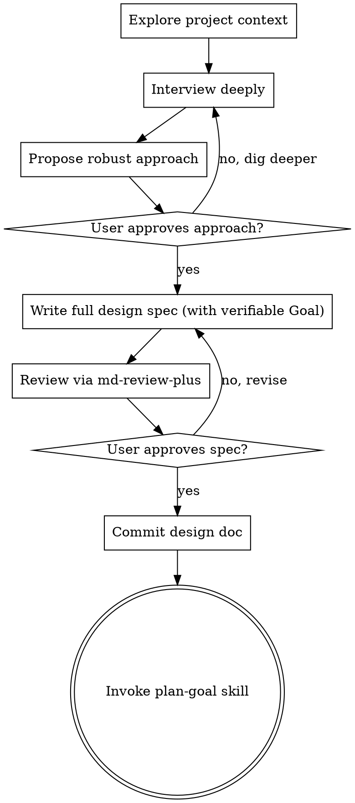

# Goal-Oriented Brainstorm → Plan Variant — Implementation Plan

**Goal:** Ship two opt-in skills (`brainstorm-goal`, `plan-goal`) whose plan handoff emits a copy-paste `/clear` → `/goal <condition>` → `/execute <plan>` block, and register them across both plugin repos.
**Architecture:** `brainstorm-goal` clones `brainstorm` but mandates a machine-verifiable §1 Goal and hands off to `plan-goal`; `plan-goal` clones `plan` but distills that §1 Goal into an inline proof-command `/goal` condition and emits a dual handoff. `execute` is reused untouched (user runs `/goal` manually). Registration spans `seiraiyu-superwisdom` (skills + plugin.json + README), `seiraiyu-marketplace` (marketplace.json), and `seiraiyu-skills` parent (submodule pointers).
**Tech Stack:** Markdown skill files with YAML frontmatter; JSON plugin manifests; git submodules.

**Design doc:** `docs/plans/2026-07-02-goal-oriented-brainstorm-plan-design.md` (approved 11/11 via md-review-plus).

All paths below are relative to the seiraiyu-skills superrepo root: `/home/stonelyd/seiraiyu-skills`.

## Status

| Task | Description | Status | Tested | Pushed |
|------|-------------|--------|--------|--------|
| 1 | Create `brainstorm-goal/SKILL.md` | pending | no | no |
| 2 | Create `plan-goal/SKILL.md` | pending | no | no |
| 3 | Bump `plugin.json` → 1.2.0 | pending | no | no |
| 4 | Add both skills to superwisdom `README.md` | pending | no | no |
| 5 | Update `marketplace.json` superwisdom entry | pending | no | no |
| 6 | Structural verification (design §1 criteria 1–9) | pending | no | no |
| 7 | Commit both submodules + bump parent pointers | pending | no | no |

---

### Task 1: Create `brainstorm-goal` skill

**Files:**
- Create: `seiraiyu-superwisdom/skills/brainstorm-goal/SKILL.md`

**Step 1: Write the file** with exactly this content:

````markdown
---
name: brainstorm-goal
description: Goal-oriented brainstorm — turn rough ideas into design specs whose §1 is a machine-verifiable Goal, so the plan step can emit a copy-paste /goal + /execute handoff. Use when you want autonomous goal-tracked execution.
allowed-tools: Bash(md-review-plus:*) Bash(git:*) Read Glob Grep Write AskUserQuestion Skill
---

# Brainstorm (Goal-Oriented)

Same deep-interview discipline as `brainstorm`, with one hard addition: the design spec's **first section is a machine-verifiable Goal** that `/goal` can consume during execution. The terminal state is `plan-goal`, not `plan`.

Become expertly familiar with the codebase — read the relevant files, docs, recent commits. Understand the project deeply before asking a single question.

Even simple projects require a design. The design can be short, but it must exist, carry a verifiable Goal, and be approved.

You *** MUST ALWAYS *** use md-review-plus for reviewing the design doc. No exceptions. The user must have the opportunity to comment in the browser, not just approve/reject via `AskUserQuestion`.

## Flow



The terminal state is invoking the `plan-goal` skill. No other skill.

## Checklist

Create a TodoWrite item for each:

1. Explore project context — files, docs, recent commits
2. Interview user via `AskUserQuestion` until design is fully understood
3. Propose the robust approach via `AskUserQuestion` for approval
4. Write complete design spec to `docs/plans/YYYY-MM-DD-<topic>-design.md`, with §1 a machine-verifiable Goal
5. Review via `md-review-plus <file> --review`, iterate until approved
6. Commit the design doc
7. Hand off to `plan-goal` skill

## Interview

Use `AskUserQuestion` to interview about anything: technical implementation, UX, concerns, tradeoffs, edge cases, failure modes, scaling, maintenance. Not-obvious questions. In-depth.

- One question at a time. Never batch.
- Multiple choice preferred — concrete options, not open-ended.
- Continue until the design is fully understood. Don't cut it short.
- **Additionally probe for the Goal:** what is the measurable end state, and which commands prove it? You cannot write a verifiable Goal without knowing the proof commands.

## Propose the approach

Propose the single most robust, correct approach. Explain why it's right and what alternatives you rejected. Present via `AskUserQuestion` for approval.

## Write the spec

Write the complete design spec in one shot — the full document, not section-by-section.

Include: goal, constraints, architecture, components, data flow, error handling, testing approach, and all decisions from the interview.

### §1 MUST be a machine-verifiable Goal

The first section is the Goal, written so `/goal` can consume it. It has two parts:

1. **A distilled inline `/goal` condition** (≤4000 chars) — proof-command-embedded: one measurable end state + the exact commands that prove it + constraints that must not change. `/goal`'s evaluator only reads what Claude surfaces in the conversation — it does NOT run commands or read files — so phrase every clause as something Claude's printed output demonstrates. Example:

   > **`/goal` All plan tasks complete AND `pytest -q` output shows "0 failed" AND `git status` shows a clean tree AND no files outside `src/auth/` were modified.**

2. **A full acceptance-criteria checklist** (table) for humans and for the executing agent to work against:

   | # | Criterion | Proof command | Pass condition |
   |---|-----------|---------------|----------------|
   | 1 | ... | `...` | ... |

Never write the Goal as prose or aspirations. If you don't yet know the proof commands, go back and interview.

### Phase tracking table

```
| Phase | Description | Status | Tested | Pushed |
|-------|-------------|--------|--------|--------|
| 1 | ... | pending | no | no |
```

## Review

Review with `md-review-plus <file> --review`. User approves, rejects, or comments in the browser. Iterate until approved. Commit when done.

## Principles

- YAGNI ruthlessly
- Write complete specs, not drip-feeds
- Every design gets a verifiable Goal, no exceptions
````

**Step 2: Verify frontmatter parses and content is right**
Run: `head -5 seiraiyu-superwisdom/skills/brainstorm-goal/SKILL.md && grep -c 'plan-goal' seiraiyu-superwisdom/skills/brainstorm-goal/SKILL.md`
Expected: shows `name: brainstorm-goal` in the header, and the grep count is `≥1`.

**Step 3: Commit** — deferred to Task 7 (batched submodule commit).

---

### Task 2: Create `plan-goal` skill

**Files:**
- Create: `seiraiyu-superwisdom/skills/plan-goal/SKILL.md`

**Step 1: Write the file** with exactly this content:

````markdown
---
name: plan-goal
description: Goal-oriented plan — create a bite-sized implementation plan AND distill the design's §1 Goal into an inline /goal condition, then emit a copy-paste /clear + /goal + /execute handoff. Pairs with brainstorm-goal.
allowed-tools: Read Glob Grep Write AskUserQuestion Bash(md-review-plus:*) Bash(git:*) Skill
---

# Plan (Goal-Oriented)

Same bite-sized planning discipline as `plan`, with one addition: after the plan is written and reviewed, **distill the design doc's §1 Goal into an inline `/goal` condition** and emit a dual copy-paste handoff so the user can run goal-tracked execution.

Assume the engineer executing this plan has zero codebase context. Give them everything: exact file paths, complete code, verification commands, expected output. Every task is one action, 2–5 minutes.

## Process

1. Read the design doc — especially its §1 Goal. Explore the codebase for patterns, dependencies, existing code.
2. Break work into bite-sized tasks. Each task = one action (write test, run test, implement, verify, commit).
3. If anything is ambiguous, use `AskUserQuestion` to clarify before writing the plan.
4. Write the full plan to `docs/plans/YYYY-MM-DD-<feature>-plan.md`.
5. Review with `md-review-plus <file> --review`. Iterate until approved.
6. **Distill the Goal** (see below) and present the dual handoff.

## Plan header

```
# [Feature Name] Implementation Plan

**Goal:** [One sentence]
**Architecture:** [2-3 sentences]
**Tech Stack:** [Key technologies]
```

## Task tracking

Every plan includes a status table at the top, below the header:

```
| Task | Description | Status | Tested | Pushed |
|------|-------------|--------|--------|--------|
| 1 | ... | pending | no | no |
```

## Task format

```
### Task N: [Component Name]

**Files:**
- Create: `exact/path/to/file.ext`
- Modify: `exact/path/to/existing.ext:123-145`
- Test: `tests/exact/path/to/test.ext`

**Step 1: Write failing test**
[Complete code]

**Step 2: Run test, verify failure**
Run: `[exact command]`
Expected: FAIL with "[specific message]"

**Step 3: Implement**
[Complete code]

**Step 4: Run test, verify pass**
Run: `[exact command]`
Expected: PASS

**Step 5: Commit**
`git commit -m "feat: [description]"`
```

## Distill the Goal

Read the design doc's §1 Goal. It contains a full acceptance-criteria checklist. Distill it into ONE inline `/goal` condition string that:

- Is **≤4000 chars** (`/goal` accepts inline text only — never a file path).
- Is **proof-command-embedded**: names the exact commands `/execute` must run AND surface, their expected output, and the scope constraints. `/goal`'s evaluator only judges what Claude surfaces in the conversation — it does not run commands or read files — so every clause must be demonstrable from Claude's printed output.
- Keeps only the top gating checks inline if the full checklist would blow the char budget; point Claude to re-run the named proof commands for the rest, and note anything you dropped.

If the design doc has **no §1 Goal**, do NOT fabricate one. Stop and tell the user to run `brainstorm-goal` (or add a verifiable Goal section) first.

## Handoff

After the plan is written and reviewed, present exactly this — a dual copy-paste block:

```
Plan complete: `docs/plans/YYYY-MM-DD-<feature>-plan.md`
Goal distilled from: `docs/plans/YYYY-MM-DD-<feature>-design.md` §1

To execute goal-tracked with a clean context, run `/clear` then paste:

/goal <distilled proof-command-embedded condition>
/execute docs/plans/YYYY-MM-DD-<feature>-plan.md
```

`/goal` first (sets the session completion condition), then `/execute` (the task Claude works on until the condition holds). Use the actual file paths. The user — not Claude — runs `/goal`.

## Rules

- Exact file paths, always
- Complete code, not pseudo-code
- Exact commands with expected output
- DRY, YAGNI, TDD, frequent commits
- The `/goal` condition must be provable from surfaced output, never from unread files
````

**Step 2: Verify**
Run: `head -5 seiraiyu-superwisdom/skills/plan-goal/SKILL.md && grep -c '/goal' seiraiyu-superwisdom/skills/plan-goal/SKILL.md && grep -Ec '/(execute|clear)' seiraiyu-superwisdom/skills/plan-goal/SKILL.md`
Expected: header shows `name: plan-goal`; `/goal` count `≥3`; `/execute|/clear` count `≥2`.

**Step 3: Commit** — deferred to Task 7.

---

### Task 3: Bump `plugin.json` to 1.2.0

**Files:**
- Modify: `seiraiyu-superwisdom/.claude-plugin/plugin.json:4`

**Step 1: Edit** — change the version line from `"version": "1.1.0",` to `"version": "1.2.0",`.

**Step 2: Verify**
Run: `grep '"version"' seiraiyu-superwisdom/.claude-plugin/plugin.json`
Expected: `  "version": "1.2.0",`

Also confirm valid JSON:
Run: `python3 -c "import json; json.load(open('seiraiyu-superwisdom/.claude-plugin/plugin.json')); print('ok')"`
Expected: `ok`

---

### Task 4: Add both skills to superwisdom `README.md`

**Files:**
- Modify: `seiraiyu-superwisdom/README.md:18` (Skills table)

**Step 1: Edit** — insert two rows into the Skills table. After the `**brainstorm**` row add:

```
| **brainstorm-goal** | Goal-oriented brainstorm — design spec's §1 is a machine-verifiable Goal |
```

After the `**plan**` row add:

```
| **plan-goal** | Goal-oriented plan — distills the Goal into a copy-paste /goal + /execute handoff |
```

**Step 2: Verify**
Run: `grep -E 'brainstorm-goal|plan-goal' seiraiyu-superwisdom/README.md`
Expected: both rows matched.

---

### Task 5: Update `marketplace.json` superwisdom entry

**Files:**
- Modify: `seiraiyu-marketplace/.claude-plugin/marketplace.json` (the `superwisdom` plugin object — currently `"version": "1.0.0"` and its `description`)

**Step 1: Edit** the superwisdom entry:
- Change `"version": "1.0.0",` → `"version": "1.2.0",`
- Change its `"description"` to:
  `"Streamlined development workflow skills — brainstorm, plan, execute, TDD, debug, review, teams, git-flow, verify — plus goal-oriented brainstorm-goal/plan-goal that emit a copy-paste /goal + /execute handoff. Professional, team-oriented, lean."`

**Step 2: Verify**
Run: `python3 -c "import json; d=json.load(open('seiraiyu-marketplace/.claude-plugin/marketplace.json')); p=[x for x in d['plugins'] if x['name']=='superwisdom'][0]; print(p['version']); print('goal' in p['description'])"`
Expected: prints `1.2.0` then `True`.

---

### Task 6: Structural verification (design §1 criteria 1–9)

**Step 1: Run all checks** from the repo root `/home/stonelyd/seiraiyu-skills`:

```
head -6 seiraiyu-superwisdom/skills/brainstorm-goal/SKILL.md      # crit 1: name: brainstorm-goal
head -6 seiraiyu-superwisdom/skills/plan-goal/SKILL.md            # crit 2: name: plan-goal
grep -c 'plan-goal' seiraiyu-superwisdom/skills/brainstorm-goal/SKILL.md   # crit 3: >=1
grep -c '/goal' seiraiyu-superwisdom/skills/plan-goal/SKILL.md            # crit 4: >=3
grep -Ec '/(execute|clear)' seiraiyu-superwisdom/skills/plan-goal/SKILL.md # crit 5: >=2
git -C seiraiyu-superwisdom status --porcelain skills/brainstorm skills/plan skills/execute  # crit 6: empty
grep '"version"' seiraiyu-superwisdom/.claude-plugin/plugin.json          # crit 7: 1.2.0
python3 -c "import json; d=json.load(open('seiraiyu-marketplace/.claude-plugin/marketplace.json')); p=[x for x in d['plugins'] if x['name']=='superwisdom'][0]; print(p['version'], 'goal' in p['description'])"  # crit 8: 1.2.0 True
grep -E 'brainstorm-goal|plan-goal' seiraiyu-superwisdom/README.md        # crit 9: both
```

Expected: crit 1 = `name: brainstorm-goal`; crit 2 = `name: plan-goal`; crit 3 ≥ 1; crit 4 ≥ 3; crit 5 ≥ 2; crit 6 = empty output (originals untouched); crit 7 = `1.2.0`; crit 8 = `1.2.0 True`; crit 9 = both rows.

**Step 2:** If any check fails, fix the corresponding task before proceeding.

---

### Task 7: Commit submodules and bump parent pointers

Commit only when all Task 6 checks pass. Do **not** push unless the user asks.

**Step 1: Commit the superwisdom submodule**
```
git -C seiraiyu-superwisdom add skills/brainstorm-goal/SKILL.md skills/plan-goal/SKILL.md .claude-plugin/plugin.json README.md docs/plans/2026-07-02-goal-oriented-brainstorm-plan-plan.md
git -C seiraiyu-superwisdom commit -m "feat(skills): goal-oriented brainstorm-goal + plan-goal variants

New opt-in skills that emit a copy-paste /clear + /goal + /execute
handoff. Bumps plugin to 1.2.0.

Co-Authored-By: Claude Opus 4.8 (1M context) <noreply@anthropic.com>"
```

**Step 2: Commit the marketplace submodule**
```
git -C seiraiyu-marketplace add .claude-plugin/marketplace.json
git -C seiraiyu-marketplace commit -m "chore(marketplace): superwisdom 1.2.0 — add brainstorm-goal/plan-goal

Co-Authored-By: Claude Opus 4.8 (1M context) <noreply@anthropic.com>"
```

**Step 3: Bump parent submodule pointers**
```
git -C /home/stonelyd/seiraiyu-skills add seiraiyu-superwisdom seiraiyu-marketplace
git -C /home/stonelyd/seiraiyu-skills commit -m "chore: bump superwisdom + marketplace for goal-oriented variants

Co-Authored-By: Claude Opus 4.8 (1M context) <noreply@anthropic.com>"
```

**Step 4: Verify**
Run: `git -C seiraiyu-superwisdom log --oneline -1 && git -C seiraiyu-marketplace log --oneline -1 && git -C /home/stonelyd/seiraiyu-skills log --oneline -1`
Expected: three commits, one per repo, matching the messages above.

**Note:** the parent already had `superwisdom-db` shown as modified in the initial status; that is a pre-existing unrelated submodule change — do NOT stage it in Step 3 (stage only `seiraiyu-superwisdom` and `seiraiyu-marketplace` explicitly, as written).

---

## Out of scope (YAGNI)

- No `execute-goal` (Claude can't self-run `/goal`).
- No changes to `debug`, `tdd`, `review`, `teams`, `git-flow`, `verify`, `boot`, or the original `brainstorm`/`plan`.
- No `.goal` file format; `/goal` takes inline text only.
- No pushing; commits stay local unless the user asks.
