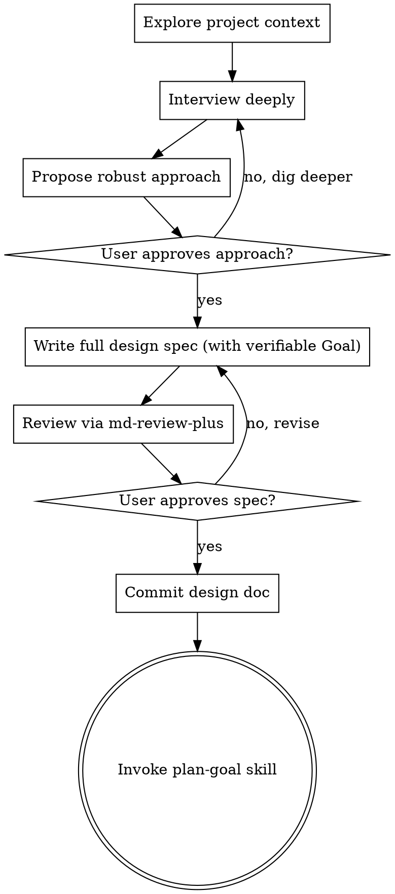

# Brainstorm (Goal-Oriented)

Same deep-interview discipline as `brainstorm`, with one hard addition: the design spec's **first section is a machine-verifiable Goal** that `/goal` can consume during execution. The terminal state is `plan-goal`, not `plan`.

Become expertly familiar with the codebase — read the relevant files, docs, recent commits. Understand the project deeply before asking a single question.

Even simple projects require a design. The design can be short, but it must exist, carry a verifiable Goal, and be approved.

Always review the design doc with md-review-plus — no exceptions. The user must have the opportunity to comment in the browser, not just approve/reject via `AskUserQuestion`.

## Flow



The terminal state is invoking the `plan-goal` skill. No other skill.

## Checklist

Create a tracked task (TaskCreate) for each:

1. Explore project context — files, docs, recent commits
2. Interview user via `AskUserQuestion` until design is fully understood
3. Propose the robust approach via `AskUserQuestion` for approval
4. Write complete design spec to `docs/plans/YYYY-MM-DD-<topic>-design.md`, with §1 a machine-verifiable Goal
5. Review via `md-review-plus <file> --review --remote`, show the user the review URL, iterate until approved
6. Commit the design doc
7. Hand off to `plan-goal` skill

## Interview

Use `AskUserQuestion` to interview about anything: technical implementation, UX, concerns, tradeoffs, edge cases, failure modes, scaling, maintenance. Not-obvious questions. In-depth.

- One question at a time. Never batch.
- Multiple choice preferred — concrete options, not open-ended.
- Continue until the design is fully understood. Don't cut it short.
- **Additionally probe for the Goal:** what is the measurable end state, and which commands prove it? You cannot write a verifiable Goal without knowing the proof commands.

## Propose the approach

Propose the single most robust, correct approach. Explain why it's right and what alternatives you rejected. Present via `AskUserQuestion` for approval.

## Write the spec

Write the complete design spec in one shot — the full document, not section-by-section.

Include: goal, constraints, architecture, components, data flow, error handling, testing approach, and all decisions from the interview.

### §1 MUST be a machine-verifiable Goal

The first section is the Goal, written so `/goal` can consume it. It has two parts:

1. **A distilled inline `/goal` condition** (≤4000 chars) — proof-command-embedded: one measurable end state + the exact commands that prove it + constraints that must not change. `/goal`'s evaluator only reads what Claude surfaces in the conversation — it does NOT run commands or read files — so phrase every clause as something Claude's printed output demonstrates. Example:

   > **`/goal` All plan tasks complete AND `pytest -q` output shows "0 failed" AND `git status` shows a clean tree AND no files outside `src/auth/` were modified.**

2. **A full acceptance-criteria checklist** (table) for humans and for the executing agent to work against:

   | # | Criterion | Proof command | Pass condition |
   |---|-----------|---------------|----------------|
   | 1 | ... | `...` | ... |

Never write the Goal as prose or aspirations. If you don't yet know the proof commands, go back and interview.

### Phase tracking table

```
| Phase | Description | Status | Tested | Pushed |
|-------|-------------|--------|--------|--------|
| 1 | ... | pending | no | no |
```

## Review

Review with `md-review-plus <file> --review --remote`. The command prints a review URL — always display it to the user as soon as it appears, so they can open the review in their browser; never leave it buried in tool output. User approves, rejects, or comments in the browser. Iterate until approved. Commit when done.

## Principles

- YAGNI ruthlessly
- Write complete specs, not drip-feeds
- Every design gets a verifiable Goal, no exceptions
