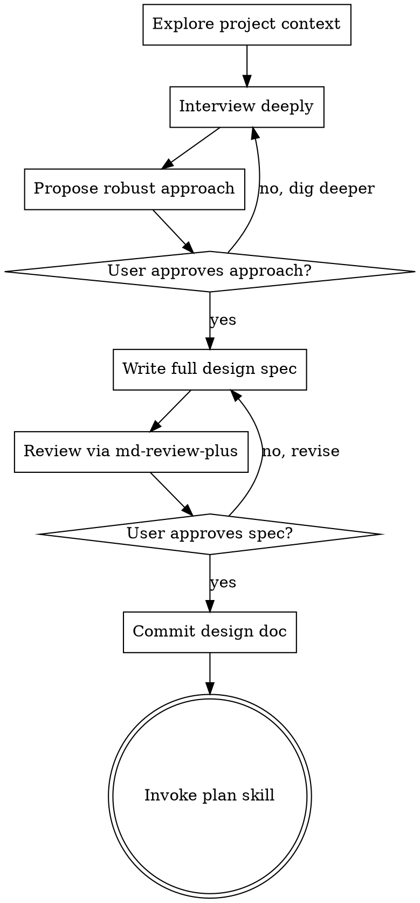

# Brainstorm

Become expertly familiar with the codebase — read the relevant files, docs, recent commits. Understand the project deeply before asking a single question.

Even simple projects require a design. The design can be short, but it must exist and be approved.

You *** MUST ALWAYS *** use md-review-plus for reviewing the design doc. No exceptions. This is non-negotiable. The user must have the opportunity to comment in the browser, not just approve/reject via `AskUserQuestion`.

## Flow



The terminal state is invoking the `plan` skill. No other skill. Not `execute`, not `tdd`, not anything else.

## Checklist

Create a TodoWrite item for each:

1. Explore project context — files, docs, recent commits
2. Interview user via `AskUserQuestion` until design is fully understood
3. Propose the robust approach via `AskUserQuestion` for approval
4. Write complete design spec to `docs/plans/YYYY-MM-DD-<topic>-design.md`
5. Review via `md-review-plus <file> --review`, iterate until approved
6. Commit the design doc
7. Hand off to `plan` skill

## Interview

Use `AskUserQuestion` to interview the user about literally anything: technical implementation, UI & UX, concerns, tradeoffs, edge cases, failure modes, scaling, maintenance burden. Make sure the questions are not obvious. Be very in-depth.

- One question at a time. Never batch.
- Multiple choice preferred — provide concrete options, not open-ended "what do you think?"
- Continue interviewing continually until the design is fully understood. Don't cut it short.

## Propose the approach

When you have enough context, propose the single most robust, correct approach. Not a shortcut. Not a quick fix. Not a workaround. The right solution to the problem. Explain why it's right and what alternatives you rejected. Present via `AskUserQuestion` for approval.

## Write the spec

Write the complete design spec in one shot. Not section-by-section. The full document.

Include: goal, constraints, architecture, components, data flow, error handling, testing approach, and all decisions from the interview.

The spec must include a **phase tracking table**:

```
| Phase | Description | Status | Tested | Pushed |
|-------|-------------|--------|--------|--------|
| 1 | ... | pending | no | no |
| 2 | ... | pending | no | no |
```

## Review

Write the full document, then review with `md-review-plus <file> --review`. User approves, rejects, or comments in the browser. Iterate until approved. Commit when done.

## Principles

- YAGNI ruthlessly — if it might not be needed, cut it
- Write complete specs, not drip-feeds
- Every project gets a design, no exceptions
